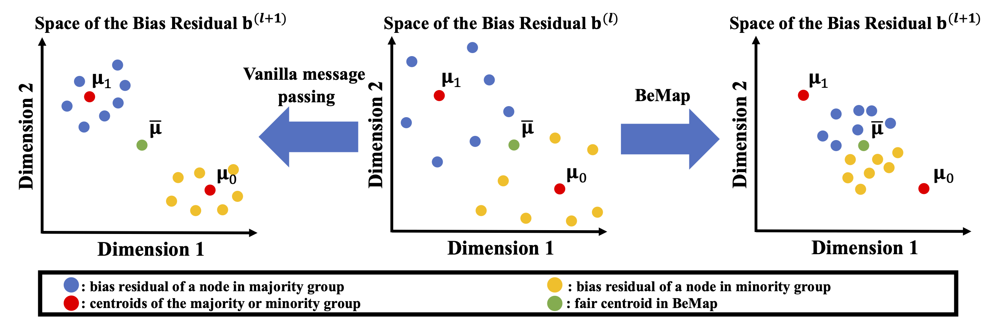
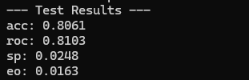
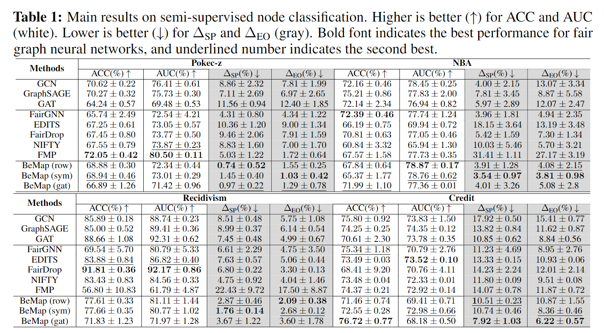
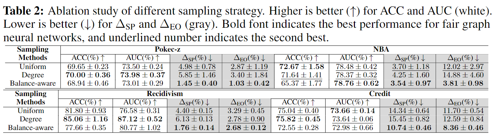

# BeMap
<h3 align="center">BeMap: Balanced Message Passing for Fair Graph Neural Network (LOG 2023) </h3>
<h3 align="center"> 
  Links: 
  <a href="https://arxiv.org/pdf/2306.04107.pdf"> Paper </a> | 
  <a href="https://openreview.net/attachment?id=4RiLDrCbzW&name=poster_preview"> Poster </a> |  
  <a href="https://arxiv.org/abs/2306.04107"> arXiv </a>
</h3>

BeMap is a *fair message passing* method for solving the unfairness problem on graph machine learning. It is a model-agnostic easy-to-implement solution that is able to effectively mitigate *structural bias* for most typical GNNs, such as GCN and GAT.


## Cite Us
If you find this repository helpful in your work or research, we would greatly appreciate citations to the following paper:

```bibtex
@inproceedings{lin2023bemap,
  title={BeMap: Balanced Message Passing for Fair Graph Neural Network},
  author={Lin, Xiao and Kang, Jian and Cong, Weilin and Tong, Hanghang},
  booktitle={The Second Learning on Graphs Conference},
  year={2023}
}
```

## Background
We introduce a novel fair message passing method named BeMap. It creates a fair graph structure for each epoch by leveraging a balance-aware sampling strategy to balance the number of the 1-hop neighbors of each node among different demographic groups. The intuition of mitigating structural bias is to push the bias residual for all the nodes to converge at the same fair centroid. The figure below gives an overview of BeMap.



## Requirement
**Main dependencies**:
- [Python](https://www.python.org/) (= 3.9)
- [Pytorch](https://pytorch.org/) (= 2.1.0)
- [dgl](https://www.dgl.ai/) (= 2.1.0)
- [Pandas](https://pandas.pydata.org/) (= 2.2.1)
- [Numpy](https://numpy.org/doc/stable/index.html#) (= 1.26.4)
- [scikit-learn](https://scikit-learn.org/stable/index.html) (= 1.4.1)

**To install requirements, run:**

```bash
pip install -r requirements.txt
```

## Usage

### 1. Datasets
 - Pokec_z is stored in [dataset/pokec](dataset/pokec) as region_job.xxx, introduced by [Enyan Dai et al.](https://arxiv.org/abs/2009.01454)
 - NBA is stored in [dataset/NBA](dataset/NBA) as nba.xxx, introduced by [Enyan Dai et al.](https://arxiv.org/abs/2009.01454).
 - Recidivism is stored in [dataset/bail](dataset/bail), introduced by [Chirag Agarwa et al.](https://arxiv.org/pdf/2102.13186.pdf).
 - Credit is stored in [dataset/credit_compressed](dataset/credit_compressed), introduced by [Chirag Agarwa et al.](https://arxiv.org/pdf/2102.13186.pdf).
     - We can extract [credit.zip](dataset/credit_compressed/) using the following command:
       ```bash
       unzip -d ./dataset ./dataset/credit_compressed/credit.zip
       ```

### 2. Running BeMap

We can run BeMap by the following command:

```bash
python train_bemap.py --dataset dataset_name --model model_name
```
For example, if we want to run BeMap on NBA dataset with GCN, we can excute the following command:

```bash
python train_bemap.py --dataset nba --model gcn
```

### 3. Experiment results

### an example when running BeMap on the Recidivism dataset with GCN:



### Overall results on real-world datasets



### Ablation study on balance-aware sampling strategy



## Contact
If you have any questions or want to use the code, feel free to contact:
- Xiao Lin (xiaol13@illinois.edu)
